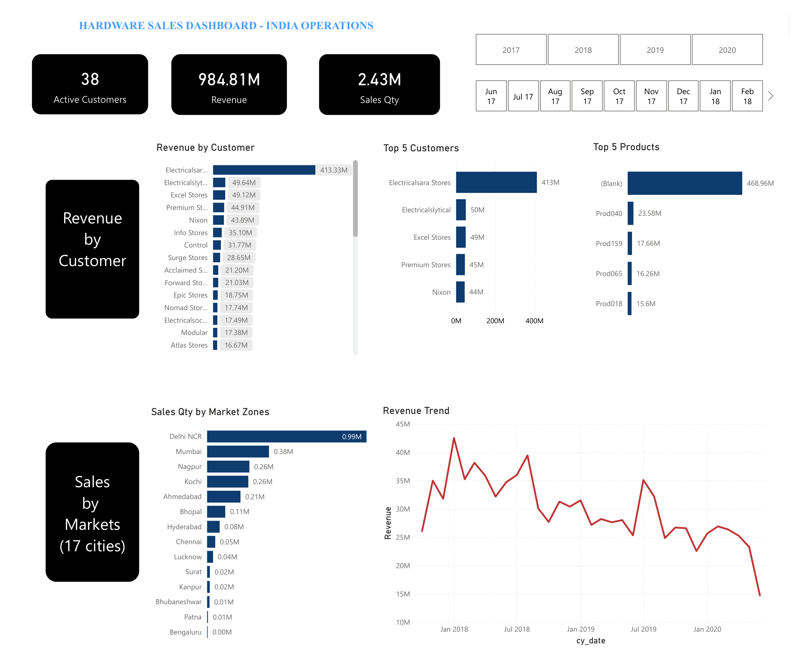

# Hardware Sales Analysis - India Market (2017-2020)

** 📌 Project Overview **

End-to-end data analytics project for a hardware distributor operating across **17 cities in India**. 
Analyzed **150,283 transactions** to identify revenue trends, customer concentration risks, and market expansion opportunities.
-------------------------------------------------
|  Metric             | Value                    |
|---------------------|--------------------------|
| Transactions        | 150,283                  |
| Customers           | 38                       |
| Products            | 279                      |
| Markets             | 17 Cities                |
| Time Period         | 2017-2020                |
| Tools               | MySQL, Power BI, GitHub  |
-------------------------------------------------

**Project Workflow**
 --------------------------------------------------------------------------------------------------------
| Step | Tool            | Task                                                                         |
|------|-----------------|------------------------------------------------------------------------------|
| 1️⃣  | **MySQL**       | Imported Sales.csv file using Table Data Import Wizard                        |
| 2️⃣  | **MySQL**       | Data exploration: row counts, date ranges, duplicates, currency               |
| 3️⃣  | **Power Query** | Data cleaning: removed duplicates, filtered invalid data, converted USD → INR |
| 4️⃣  | **Power BI**    | Created relationships (star schema)                                           |
| 5️⃣  | **Power BI**    | Built DAX measures:Active Customers, Revenue, Sales Quantity,etc.             |
| 6️⃣  | **Power BI**    | Designed one-page dashboard                                                   |
| 7️⃣  | **GitHub**      | Published portfolio                                                           |
 --------------------------------------------------------------------------------------------------------
---

**Dashboard Visuals**
--------------------------------------------------------------------
| Visual         | Description                                     |
|----------------|-------------------------------------------------|
| **KPI Cards**  | Total Revenue, Total Sales Qty, Total Customers |
| **Bar Chart**  | Revenue by Customer                             |
| **Bar Chart**  | Top 5 Customers                                 |
| **Bar Chart**  | Top 5 Products                                  |
| **Table**      | Sales Qty by Market Zones (17 cities)           |
| **Line Chart** | Revenue Trend 2018-2020                         |
| **Slicer**     | Year filter (2017-2020)                         |
-------------------------------------------------------------------

 **Repository Contents**
--------------------------------------------------------------------------------------------
|   File                              | Description                                        |
|-------------------------------------|----------------------------------------------------|
| `Hardware Sales Analysis India.pbix`| Power BI dashboard file                            |
| `Hardware Sales Analysis India.pdf` | PDF export of dashboard                            |
| `EDA.sql`                           | Complete SQL analysis (20+ queries) + DAX measures |
| `Hardware Sales Analysis India.png` | Dashboard screenshot                               |
--------------------------------------------------------------------------------------------
---

**🛠️ Tools Used**

- **MySQL**         – Data import and exploration
- **Power BI**      – Data cleaning, DAX measures, visualization
- **Power Query**   – ETL (duplicates, currency conversion)
- **GitHub**        – Portfolio hosting

---
Email:khinezinnyunt888@gmail.com
---
